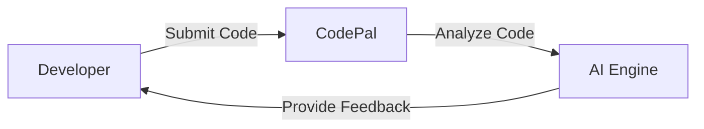

# CodePal
## Introduction
CodePal is an AI-powered code review tool designed to provide instant feedback on code quality, security, and best practices.
## Problem Statement
Manual code reviews are time-consuming and prone to human error. CodePal aims to automate the code review process, freeing up developers to focus on writing high-quality code.
## Why it Matters
CodePal helps developers write better code, reduces the risk of security vulnerabilities, and improves overall code maintainability.
## Architecture Diagram

## Project Structure
```
CodePal/
|---- README.md
|---- CONTRIBUTING.md
|---- requirements.txt
|---- main.py
|---- src/
|       |---- core.py
|       |---- utils.py
```
## Installation Steps
1. Clone the repository: `git clone https://github.com/your-username/CodePal.git`
2. Install dependencies: `pip install -r requirements.txt`
3. Run the application: `python main.py`
## Quick Start
1. Write some code in your favorite IDE.
2. Submit the code to CodePal for review.
3. Receive instant feedback on code quality, security, and best practices.
## Configuration
CodePal uses a configuration file (`config.json`) to store settings. You can modify this file to customize the tool to your needs.
## Design Decisions
* Used Python as the primary programming language.
* Leveraged the `transformers` library for AI-powered code analysis.
* Implemented a modular architecture for easy maintenance and extensibility.
## Roadmap
* Improve the accuracy of the AI engine.
* Add support for multiple programming languages.
* Integrate with popular IDEs.
## Contribution
Contributions are welcome! Please follow the guidelines outlined in the `CONTRIBUTING.md` file.
## License
CodePal is licensed under the MIT License.
